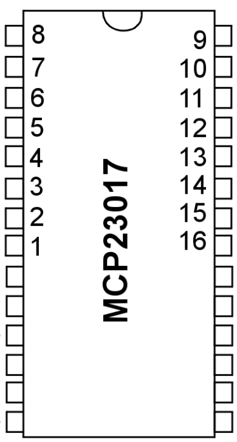

# MCP23017 Library
Easy to use library for the MCP23017 connected to a Raspberry Pi.

### Installation

i2c is required to be enabled in order to communicate with the chip. Also install these packages:

```sh
$ sudo apt-get install python-smbus i2c-tools
```

### Usage

This library aims at being very similar to the RPi.GPIO library. At the moment it provides the following functions:

`setup(pin, mode)`: Writes direction (IN, OUT) to the specified pin.
`output(pin, dir)`: Writes state (HIGH, LOW) to the specified pin.
`input(pin)`: Reads and returns pin state (True, False)
`dirRead(bank)`: Reads and returns the direction registers from both GPIO banks.
   - Valid parameter values: BANK_A, BANK_B, ALL or leave blank for a default graphic diagram of both banks.
`latRead(bank)`: Reads and returns the latch registers from both GPIO banks.
   - Valid parameter values: LAT_A, LAT_B, ALL or leave blank for a default graphic diagram of both banks.

Please refer to the image below for the pin mapping.

### Pinout

Pins are mapped according to this diagram:



### Code example

This example will set pin #2 as an input and #1 as an output.
When the input goes `high`, pin #1 will also go high.

```py
import mcp23017_lib as MCP

MCP.setup(2, MCP.IN)
MCP.setup(1, MCP.OUT)

while 1:
   if(MCP.read(2)):
      MCP.write(1, MCP.HIGH)
   else:
      MCP.write(1, MCP.LOW)
```

### TODO list

 * Do not use hardcoded i2c address
 * Add raw write function
 * Add pullup function
 * Finish function documentation

### Contributors

Development:
 *  [@ResonantWave](https://github.com/ResonantWave)

### Contributing

* The code is licensed under the [GPL V3](LICENSE)
* Feel free to contribute to the code
